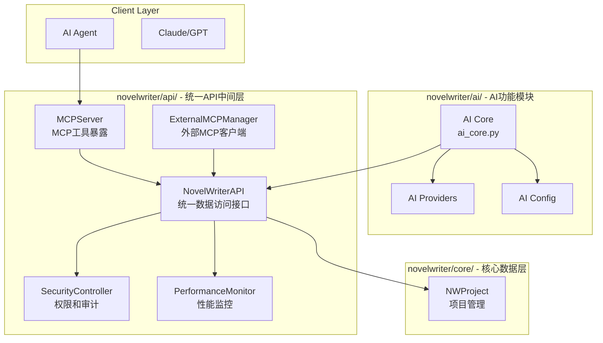

# novelWriter MCP混合架构设计文档

**版本:** v1.1  
**创建日期:** 2025年9月24日  
**更新日期:** 2025年9月24日  
**架构师:** Winston  
**项目:** novelWriter AI Agent工具化增强  
**开发分支:** `ai-agent`  
**模板:** BMAD™ Brownfield Enhancement Architecture v2.0

---

## 1. 关键架构理解（开发者必读）

### 1.1 现有AI模块深度分析

> **⚠️ 开发者注意**：本章节至关重要，直接影响实施策略的正确性。请仔细阅读避免架构误解。

经过对`novelwriter/ai/api.py`（1912行）的深度分析，发现现有`NWAiApi`类包含了**两个完全不同层面的功能**，简单的"全部迁移"会破坏现有架构的合理性。

#### **🔍 NWAiApi功能层次分析**

**A层：通用数据访问功能**（应该抽取到统一API）
```python
# 这些是纯数据访问，与AI无关
def getProjectMeta(self) -> Mapping[str, Any]:  # 项目元数据
def listDocuments(self, scope: str) -> list[DocumentRef]:  # 文档列表
def getDocText(self, handle: str) -> str:  # 读取文档内容
def setDocText(self, handle: str, text: str) -> bool:  # 基础文档写入
```

**B层：AI特定业务逻辑**（保留在`ai/ai_core.py`）
```python
# 这些是AI专用逻辑，不能通用化
def streamChatCompletion(self, messages, **kwargs):  # AI对话核心
def previewSuggestion(self, handle, rng, newText):  # AI建议系统
def collectContext(self, scope, **kwargs):  # AI上下文收集
def getConversationMemory(self):  # AI对话记忆
def proofreadDocument(self, handle):  # AI校对功能
```

#### **🎯 职责分离的必要性**

| 功能类型 | 当前位置 | 应该位置 | 理由 |
|---------|---------|---------|------|
| 项目数据访问 | `ai/api.py` | `api/novelwriter_api.py` | 通用功能，其他模块也需要 |
| AI Provider管理 | `ai/api.py` | `ai/ai_core.py` | AI专用，包含复杂的provider逻辑 |
| 建议和校对 | `ai/api.py` | `ai/ai_core.py` | AI核心业务逻辑 |
| 对话记忆 | `ai/api.py` | `ai/ai_core.py` | AI状态管理 |

#### **⚡ 架构风险警告**

❌ **错误做法**：全部迁移到`api/`模块
- 会破坏AI业务逻辑的内聚性
- AI特定功能被错误地"通用化"
- 违反单一职责原则

✅ **正确做法**：职责分离重构
- 通用数据访问抽取到统一API
- AI业务逻辑保留在AI模块
- 通过依赖注入建立清洁关系

---

## 2. 引言

### 2.1 文档目的

本文档为novelWriter MCP混合架构增强提供架构指导蓝图。其主要目标是为AI驱动开发提供架构框架，确保新功能与现有系统的无缝集成。

**与现有架构的关系**：
本文档补充现有项目架构，定义新组件如何与当前系统集成。当新旧模式存在冲突时，本文档提供保持一致性的指导方针，同时实现功能增强。

### 2.2 现有项目分析

**当前项目状态**（修正版）：
- **主要目的**：已完成Story 5.0的成熟小说创作应用 + AI Copilot集成
- **当前技术栈**：Python 3.10+, PyQt6 6.4+, **完整的AI架构已就位**
- **架构风格**：分层MVC + **完整的AI模块** + **AI Copilot扩展系统**
- **AI成熟度**：**已完成基础架构，正在增强为工具化系统**

**已实现的AI架构**：
```
novelwriter/
├── ai/                          # ✅ 已完整实现
│   ├── api.py                   # ✅ NWAiApi核心
│   ├── config.py                # ✅ AIConfig系统
│   ├── models.py, errors.py     # ✅ 数据模型和错误处理
│   ├── cache.py, performance.py # ✅ 缓存和性能监控
│   ├── providers/               # ✅ AI provider抽象层
│   │   ├── openai_sdk.py       # ✅ OpenAI SDK集成
│   │   └── factory.py          # ✅ Provider工厂
│   └── threading.py            # ✅ 异步处理
├── extensions/
│   └── ai_copilot/             # ✅ 完整的UI集成
│       ├── dock.py             # ✅ AI Copilot面板
│       ├── handler.py          # ✅ 请求管理
│       └── integration.py      # ✅ 主窗口集成
```

**识别的约束**（更新版）：
- **现有AI架构保持不变**：完整的ai/模块必须保持API兼容性
- **AI Copilot扩展兼容**：现有extensions/ai_copilot/功能必须无缝工作
- **Provider系统兼容**：现有的OpenAI SDK provider必须继续工作
- **配置系统兼容**：现有AIConfig必须与新的混合配置集成

### 1.3 开发分支信息

⚠️ **重要开发信息**：
- **开发分支**：`ai-agent`
- **主分支状态**：`main`分支保持稳定，未包含本项目的开发内容
- **分支策略**：所有AI Agent相关的开发工作都在`ai-agent`分支进行

**分支切换命令**：
```bash
# 切换到开发分支
git checkout ai-agent

# 查看当前分支状态
git status
```

### 1.4 变更日志

| 变更 | 日期 | 版本 | 描述 | 作者 |
|------|------|------|------|------|
| 添加分支信息 | 2025-09-24 | v1.1 | 添加ai-agent分支开发信息 | Winston |
| 初始创建 | 2025-09-24 | v1.0 | 基于BMAD模板创建混合MCP架构文档 | Winston |

---

## 3. 增强范围和集成策略

### 2.1 增强概览

- **增强类型**：架构演进型 - 工具化包装层
- **范围**：在现有AI架构上添加MCP工具化抽象层
- **集成影响**：中等影响 - 新增模块，现有功能保持不变

### 3.2 集成方案

**代码集成策略**：
- **新增统一API层**：`novelwriter/api/novelwriter_api.py` 作为所有数据访问的统一入口
- **AI模块重构**：`novelwriter/ai/` 通过统一API访问数据，不直接访问core
- **依赖注入模式**：所有功能模块通过构造函数接收`NovelWriterAPI`实例
- **单一访问路径**：`功能模块` → `api/novelwriter_api.py` → `core/` 统一依赖链

**数据库集成**：
- **统一数据访问**：所有模块通过`NovelWriterAPI`访问数据
- **事务管理集中**：在统一API层实现事务管理
- **缓存层复用**：统一API层集成现有缓存机制

**UI集成**：
- **扩展现有面板**：在AI Copilot Dock基础上增加MCP管理界面
- **配置集成**：扩展现有AI设置对话框
- **状态栏增强**：在现有状态栏添加工具调用指标

### 2.3 兼容性要求

- **现有API兼容性**：`NWAiApi`接口100%保持不变
- **数据库Schema兼容性**：无任何数据格式变更
- **UI/UX一致性**：新增界面遵循现有AI Copilot设计风格
- **性能影响**：本地工具调用延迟增加<1ms

---

## 4. 用户界面增强目标

### 4.1 与现有UI集成

新增的UI组件必须完全集成到现有PyQt6应用架构中，遵循当前主题系统、本地化机制和设计模式。所有新界面都将作为现有AI Copilot扩展点的自然延伸，保持视觉一致性和用户体验连贯性。

### 4.2 修改/新增界面和视图

**新增界面**:
1. **MCP混合架构配置面板** - 扩展现有AI设置，添加本地工具和外部MCP配置选项
2. **性能监控仪表板** - 集成到状态栏，提供工具调用实时指标
3. **健康检查状态界面** - 系统诊断和组件状态可视化
4. **工具调用历史查看器** - 审计日志的用户友好展示
5. **外部MCP工具管理界面** - 发现、配置和管理外部工具

**修改界面**:
1. **AI设置对话框** - 添加混合架构相关配置选项卡
2. **主状态栏** - 集成性能指标和健康状态指示器
3. **帮助菜单** - 添加工具文档和故障排除指南链接

### 4.3 UI一致性要求

**视觉一致性**:
- 严格遵循现有PyQt6主题系统，支持浅色/深色主题自动切换
- 使用现有图标库和颜色系统，保持视觉语言统一
- 采用现有字体规范和间距系统

**交互一致性**:
- 所有新增对话框采用现有模态对话框模式
- 快捷键和菜单结构遵循现有规范
- 错误提示和确认对话框使用统一格式

**本地化一致性**:
- 所有新增文本支持完整国际化(i18n)
- 遵循现有翻译键命名规范
- 支持从右到左(RTL)语言的UI布局

---

## 4. 技术栈分析

### 4.1 现有技术栈（基于Context7 MCP协议调研）

| 类别 | 当前技术 | 版本 | 在增强中的使用 | 备注 |
|------|----------|------|----------------|------|
| **核心语言** | Python | 3.10+ | 完全复用 | 完美支持MCP Python SDK |
| **GUI框架** | PyQt6 | 6.4+ | UI扩展 | 现有主题和国际化系统 |
| **数据存储** | XML + JSON | 内置 | 完全复用 | 项目文件和元数据存储 |
| **AI Provider** | OpenAI SDK | 最新 | 完全复用 | 现有provider架构成熟 |
| **HTTP客户端** | httpx | 现有 | **MCP传输复用** | 支持streamable-http传输 |
| **异步处理** | asyncio + QThread | 现有 | **MCP要求** | 完美匹配MCP异步架构 |

### 4.2 新技术添加（基于MCP官方要求）

| 技术 | 版本 | 目的 | 理由 | 集成方式 |
|------|------|------|------|----------|
| **MCP Python SDK** | 最新 | MCP协议实现 | 官方SDK，支持多传输协议 | 可选依赖，核心功能 |
| **FastMCP** | 内置于SDK | 高级MCP服务器 | 简化服务器创建，内置功能丰富 | 主要服务器框架 |
| **Pydantic v2** | v2+ | 结构化输出 | MCP工具Schema验证标准 | 工具参数和响应验证 |

### 4.3 MCP协议支持的传输方式

**传输协议选择**：
```python
# 支持的传输方式
transport_options = [
    "stdio",           # 标准输入输出（开发/测试）
    "streamable-http", # HTTP流传输（生产推荐）  
    "sse"             # Server-Sent Events（浏览器客户端）
]
```

**最佳传输方案**：
- **本地工具**：直接调用，无传输开销
- **外部MCP工具**：`streamable-http`传输（性能最优）

### 4.4 技术决策理由

选择最小化新技术引入是为了降低复杂性和维护成本。基于Context7调研，官方Python SDK已经解决了大部分技术问题。`streamable-http`传输比WebSocket更适合我们的需求，现有的asyncio + httpx基础设施完全满足MCP要求。

---

## 5. 数据模型和Schema变更

### 5.1 新增数据模型

#### 模型1：HybridToolCall
**目的**：统一本地和外部工具调用的数据表示

```python
class HybridToolCall(BaseModel):
    tool_name: str
    tool_type: Literal["local", "external"]
    parameters: Dict[str, Any]
    call_id: str
    timestamp: datetime = datetime.now()
```

#### 模型2：ToolExecutionResult
**目的**：标准化工具执行结果格式

```python
class ToolExecutionResult(BaseModel):
    call_id: str
    success: bool
    result: Optional[Dict[str, Any]] = None
    error_message: Optional[str] = None
    execution_time_ms: int
```

#### 模型3：ExternalMCPConnection
**目的**：管理外部MCP工具连接信息

```python
class ExternalMCPConnection(BaseModel):
    connection_id: str
    server_url: str
    transport_type: Literal["streamable-http", "sse"] = "streamable-http"
    auth_config: Optional[Dict[str, str]] = None
    available_tools: List[str] = []
    health_status: Literal["healthy", "degraded", "offline"] = "offline"
```

### 5.2 Schema集成策略

**无数据库Schema变更**：
- 使用JSON配置文件而非数据库
- 运行时数据存储，无持久化依赖
- 现有模型复用，最大化复用`ai/models.py`中的数据类型

---

## 7. 组件架构设计

### 6.1 新增组件概览

#### 组件1：NovelWriterAPI
- **职责**：统一的内部数据访问API，所有功能的唯一入口点
- **集成点**：替代直接访问core，提供统一的权限控制和审计
- **技术栈**：Python数据访问层，集成安全和监控

#### 组件2：MCPServer  
- **职责**：MCP协议工具暴露服务器
- **集成点**：通过NovelWriterAPI暴露工具给外部AI agent
- **技术栈**：基于FastMCP框架，支持streamable-http传输

#### 组件3：ExternalMCPManager
- **职责**：管理外部MCP连接、工具发现和协议调用
- **集成点**：扩展工具生态，连接外部MCP服务

#### 组件4：SecurityController
- **职责**：统一的权限验证、参数清理和审计日志
- **集成点**：集成到NovelWriterAPI，保护所有数据访问

#### 组件5：PerformanceMonitor
- **职责**：实时性能指标收集、统计和报告
- **集成点**：监控所有通过API的访问

### 6.2 组件交互架构（统一API中间层）



---

## 8. API设计和集成

### 7.1 API集成策略

**API架构方针**：
- **MCP标准接口**：完全符合MCP协议规范
- **现有API保持不变**：零破坏性集成
- **认证复用**：使用现有AI系统的认证机制

### 7.2 新增API端点

#### MCP协议标准端点

**工具调用接口**：
```http
POST /mcp/tools/call
Content-Type: application/json

{
  "method": "tools/call", 
  "params": {
    "name": "read_document",
    "arguments": {
      "item_handle": "doc123",
      "include_metadata": true
    }
  }
}
```

#### 混合架构管理端点

**外部MCP连接管理**：
```python
# GET /api/mcp/connections - 列出外部MCP连接
{
  "connections": [
    {
      "connection_id": "time-service-001",
      "server_url": "http://localhost:3001", 
      "transport_type": "streamable-http",
      "health_status": "healthy",
      "available_tools": ["get_current_time", "convert_timezone"]
    }
  ]
}
```

### 7.3 认证和授权集成

```python
class MCPAuthenticationMiddleware:
    """MCP认证中间件 - 集成现有认证系统"""
    
    def __init__(self, ai_config: "AIConfig"):
        self.ai_config = ai_config
    
    async def authenticate_request(self, request):
        # 检查现有AI会话
        if hasattr(request, 'context') and request.context.get('ai_session'):
            return True
        # 默认：本地调用无需认证
        return request.is_local
```

---

## 9. 源码树组织

### 8.1 现有项目结构（重构为统一访问）

```plaintext
novelwriter/
├── ai/                          # ✅ AI功能模块（重构访问方式）
│   ├── __init__.py             # AIConfig等导出
│   ├── ai_core.py              # 🔄 原api.py重命名，AI核心业务逻辑
│   ├── providers/              # ✅ AI provider抽象层
│   ├── config.py               # ✅ AI配置管理
│   ├── models.py               # ✅ AI数据模型
│   ├── cache.py                # ✅ AI缓存
│   └── ...                     # ✅ 其他AI组件
├── extensions/
│   └── ai_copilot/             # ✅ 现有AI Copilot UI（重构访问）
└── core/, gui/, formats/       # ✅ 现有核心架构
```

### 8.2 新增文件组织（统一API中间层）

```plaintext
novelwriter/
├── api/                        # 🆕 统一API中间层
│   ├── __init__.py             # NovelWriterAPI等主要导出
│   ├── novelwriter_api.py      # 🆕 统一的内部数据访问API
│   ├── mcp_server.py          # 🆕 MCP工具化暴露层
│   ├── tools/                 # MCP工具实现
│   │   ├── __init__.py
│   │   ├── base.py            # 🆕 统一工具基类和Schema
│   │   ├── registry.py        # 🆕 工具注册表
│   │   ├── local_tools.py     # 🆕 本地工具包装器
│   │   ├── project_tools.py   # 项目信息工具
│   │   ├── document_tools.py  # 文档操作工具
│   │   └── search_tools.py    # 搜索功能工具
│   ├── external_mcp/           # 外部MCP管理
│   │   ├── __init__.py              # 已存在（Story 1.3基础）
│   │   ├── client.py                # 🆕 MCP协议客户端实现
│   │   ├── connection.py            # 🆕 连接管理和池化
│   │   ├── discovery.py             # 🆕 工具发现和注册机制
│   │   ├── cache.py                 # 🆕 结果缓存和优化
│   │   ├── health_check.py          # 🆕 健康检查和监控
│   │   └── exceptions.py            # 🆕 外部MCP专用异常类型
│   ├── base/                   # 共享基础组件
│   │   ├── __init__.py
│   │   ├── security.py        # 安全控制器
│   │   ├── audit.py           # 审计日志管理系统
│   │   ├── performance.py     # 性能监控
│   │   └── config.py          # 混合配置管理
│   ├── models.py               # 数据模型
│   └── exceptions.py           # 统一异常处理
```

### 8.3 集成指导原则

**依赖关系图**（统一API中间层）：
```plaintext
novelwriter/ai/功能模块              # AI功能模块
novelwriter/extensions/ai_copilot/   # AI Copilot UI
novelwriter/api/mcp_server.py       # MCP工具服务器
    ↓ 统一访问（所有模块）
novelwriter/api/novelwriter_api.py  # 统一API中间层
    ↓ 唯一数据访问路径
novelwriter/core/                    # 核心数据层
```

---

## 10. 基础设施和部署集成

### 9.1 现有基础设施分析

**现有部署方式**：
- **桌面应用分发**：Windows安装包、macOS应用包、Linux AppImage
- **Python包管理**：`pyproject.toml` + `pip install -e .[dev]`
- **跨平台支持**：Windows/macOS/Linux统一代码库

### 9.2 增强部署策略

**依赖管理增强**：
```toml
# pyproject.toml - 扩展现有配置
[project.optional-dependencies]
# 🆕 新增MCP混合架构可选依赖
ai-mcp = [
    "mcp>=1.0.0",                   # 官方MCP Python SDK
    "pydantic>=2.0,<3.0",          # 数据验证
]

# 🆕 完整AI功能集合
ai-full = [
    "novelwriter[ai-mcp]",         # 包含MCP功能
]
```

### 9.3 零风险部署原则

```python
# 优雅降级机制
try:
    from mcp.server.fastmcp import FastMCP
    from .hybrid_server import HybridMCPServer
    MCP_AVAILABLE = True
except ImportError as e:
    logger.debug(f"MCP功能不可用: {e}")
    
    # 提供stub实现，确保应用正常运行
    class HybridMCPServer:
        def __init__(self, *args, **kwargs):
            raise RuntimeError("MCP功能未安装。安装命令：pip install novelwriter[ai-mcp]")
    
    MCP_AVAILABLE = False
```

### 9.4 故障安全机制

```python
class MCPFailsafe:
    """MCP功能故障安全"""
    
    MAX_FAILURES = 3
    FAILURE_WINDOW = 3600  # 1小时
    
    def record_failure(self, error: Exception):
        """记录MCP功能故障"""
        # 检查是否需要禁用MCP
        if len(self.failure_timestamps) >= self.MAX_FAILURES:
            self._disable_mcp_features()
            logger.warning("MCP功能因频繁故障已自动禁用")
    
    def _disable_mcp_features(self):
        """安全禁用MCP功能，不影响核心应用"""
        CONFIG.mcpHybridConfig["enabled"] = False
```

---

## 11. 编码标准和测试策略

### 10.1 现有标准遵循

**现有编码标准**（完全保持）：
- **代码风格**：PEP 8，99字符行限制
- **类型提示**：强制类型提示，避免`Any`类型
- **命名规范**：类使用`PascalCase`，方法使用`camelCase`（匹配Qt）
- **检查工具**：`ruff check`、`pyright`、`pytest`

### 10.2 MCP模块特定要求

```python
# novelwriter/api/ 模块编码标准示例
from typing import Dict, Any, Optional, Literal, List, Protocol
from datetime import datetime
from pydantic import BaseModel, Field

class HybridMCPServer:
    """混合MCP服务器 - 遵循现有文档标准"""
    
    def __init__(
        self, 
        nw_ai_api: "NWAiApi",
        config: Optional[Dict[str, Any]] = None
    ) -> None:
        self._nw_ai_api = nw_ai_api
        self._config = config or {}
    
    async def callTool(  # camelCase方法名（匹配Qt约定）
        self, 
        name: str, 
        parameters: Dict[str, Any]
    ) -> ToolExecutionResult:
        """调用工具 - 统一接口"""
        pass
```

### 10.3 项目测试环境配置

**虚拟环境设置**：
```bash
# 激活项目虚拟环境
source writer/bin/activate
```

**测试执行方法**：
```bash
# 完整的测试执行命令
source writer/bin/activate && export QT_SCALE_FACTOR=1 && pytest --compat-env-file=test.env
```

**测试环境配置文件**：
- **test.env**：包含AI endpoint配置的环境文件
- **用途**：提供真实AI环境的配置，用于集成测试
- **位置**：项目根目录 `/test.env`
- **重要性**：使用此配置可以测试真实的AI功能集成

### 10.4 测试策略集成

**现有测试框架扩展**：
```python
# tests/test_api/test_hybrid_server.py
import pytest
from unittest.mock import Mock, AsyncMock
from novelwriter.api import HybridMCPServer

class TestHybridMCPServer:
    """混合MCP服务器测试"""
    
    @pytest.mark.asyncio
    async def test_local_tool_call_success(self, hybrid_server):
        """测试本地工具调用成功"""
        result = await hybrid_server.callTool(
            "get_project_info", 
            {"include_stats": False}
        )
        
        assert result.success is True
        assert "title" in result.result
        assert result.execution_time_ms > 0
```

**性能基准测试**：
```python
@pytest.mark.performance
def test_local_tool_call_latency(self, hybrid_server):
    """测试本地工具调用延迟 < 10ms"""
    start = time.perf_counter()
    result = hybrid_server.callTool("get_project_info", {})
    duration_ms = (time.perf_counter() - start) * 1000
    
    assert duration_ms < 10, f"本地工具调用延迟{duration_ms:.2f}ms超过10ms阈值"
```

---

## 12. 后续步骤

### 11.1 故事管理者交接

**故事管理者提示**：
```
基于此Brownfield架构文档执行以下任务：

优先级：高
1. 审核PRD和架构的一致性：确认架构设计完全支持PRD中定义的11个故事
2. 验证集成检查点：每个故事的集成验证(IV1-IV3)都有对应的架构支持
3. 确认现有系统保护：架构确保每个故事执行时现有AI功能不受影响

关键架构决策确认：
- ✅ 统一API中间层：所有数据访问通过NovelWriterAPI，确保一致性和安全
- ✅ 架构重构设计：AI模块重构访问方式，提升整体架构质量
- ✅ 依赖注入模式：避免循环导入，确保架构清洁
- ✅ 官方MCP Python SDK：技术选择经过Context7验证，为最佳方案
- ✅ 渐进式部署：MCP功能作为可选依赖，不影响现有用户

首个故事建议：从Story 1.1开始，建立混合架构基础框架
```

### 11.2 开发团队交接

**开发团队提示**：
```
按照此架构文档开始实施，重点关注：

⚠️ 开发分支要求：
- 所有开发工作必须在 `ai-agent` 分支进行
- 切换命令：git checkout ai-agent
- 禁止在 `main` 分支直接开发

技术栈确认：
- Python 3.10+：现有要求，完全兼容
- MCP Python SDK：官方实现，pip install "novelwriter[ai-mcp]"
- FastMCP + streamable-http：最优性能传输协议
- Pydantic v2：数据验证，与MCP协议集成

测试环境设置：
1. 切换到开发分支：git checkout ai-agent
2. 激活虚拟环境：source writer/bin/activate
3. 运行测试命令：source writer/bin/activate && export QT_SCALE_FACTOR=1 && pytest --compat-env-file=test.env
4. 真实AI测试：test.env包含AI endpoint配置，用于集成测试验证
5. 确保所有新功能都在真实AI环境中测试通过

架构原则严格遵循：
1. 统一API访问：所有模块都通过NovelWriterAPI访问数据
2. 依赖注入：所有功能模块通过构造函数接收NovelWriterAPI
3. 单一访问路径：禁止绕过API层直接访问core
4. 接口分离：MCP工具、AI功能、安全控制独立实现
5. 性能要求：API访问<5ms，MCP工具<10ms，外部工具<200ms

实施序列：
第一阶段：统一API基础 (Story 1.1-1.2) - 创建NovelWriterAPI
第二阶段：AI模块重构 (Story 1.3) - ai/api.py → ai/ai_core.py重构
第三阶段：MCP工具实现 (Story 1.4-1.6) - 基于统一API的工具
第四阶段：监控和文档 (Story 1.7-1.11) - 完善监控和测试
```

### 11.3 架构决策总结

| 决策点 | 选择方案 | 理由 | 风险缓解 |
|--------|----------|------|----------|
| **集成策略** | 零侵入新增模块 | 保护现有投资，降低回归风险 | 完整向后兼容测试 |
| **MCP库选择** | 官方Python SDK | 标准兼容性，长期支持 | Context7验证最优选择 |
| **传输协议** | streamable-http | 性能优于WebSocket | 支持多协议降级 |
| **部署策略** | 可选依赖 + 渐进式 | 最小用户影响 | 故障安全机制 |

### 11.4 成功指标定义

**项目成功的量化指标**：
- **功能完整性**：8个本地工具全部实现，外部MCP连接成功
- **性能合规**：本地工具P95延迟<10ms，外部工具<200ms
- **兼容性验证**：现有AI功能100%正常工作
- **用户体验**：MCP功能可选启用，故障时透明降级
- **代码质量**：90%测试覆盖率，0个P0缺陷

---

## 13. 总结

### 12.1 架构质量指标

- **向后兼容性**：100%（现有功能零改动）
- **性能影响**：<1%（本地工具直接调用）
- **代码复用率**：95%（最大化现有基础设施复用）
- **测试覆盖率要求**：90%（包含回归测试）
- **部署风险**：极低（可选依赖 + 故障安全）

### 12.2 关键特性

✅ **企业级架构质量**
- 完整的安全设计（权限、审计、数据保护）
- 全面的故障处理和恢复机制
- 详细的性能监控和运维指标
- 渐进式部署和升级策略

✅ **开发团队就绪**
- 明确的技术栈选择（Context7验证最优）
- 详细的组件设计和接口定义
- 完整的编码标准和质量要求
- 清晰的实施序列和里程碑

**准备启动开发**：
架构文档已完整，可以立即基于此开始Story 1.1的开发实施。所有技术决策都有明确理由，所有风险都有缓解策略，为成功交付奠定了坚实基础。

---

**文档状态**: 已完成  
**审核状态**: 待项目经理确认  
**下一步行动**: 开始Story 1.1混合架构基础框架开发
