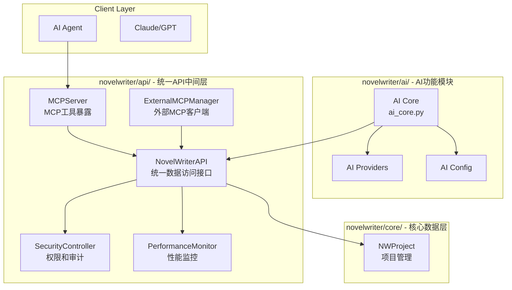

# 7. 组件架构设计

## 6.1 新增组件概览

### 组件1：NovelWriterAPI
- **职责**：统一的内部数据访问API，所有功能的唯一入口点
- **集成点**：替代直接访问core，提供统一的权限控制和审计
- **技术栈**：Python数据访问层，集成安全和监控

### 组件2：MCPServer  
- **职责**：MCP协议工具暴露服务器
- **集成点**：通过NovelWriterAPI暴露工具给外部AI agent
- **技术栈**：基于FastMCP框架，支持streamable-http传输

### 组件3：ExternalMCPManager
- **职责**：管理外部MCP连接、工具发现和协议调用
- **集成点**：扩展工具生态，连接外部MCP服务

### 组件4：SecurityController
- **职责**：统一的权限验证、参数清理和审计日志
- **集成点**：集成到NovelWriterAPI，保护所有数据访问

### 组件5：PerformanceMonitor
- **职责**：实时性能指标收集、统计和报告
- **集成点**：监控所有通过API的访问

## 6.2 组件交互架构（统一API中间层）

---
